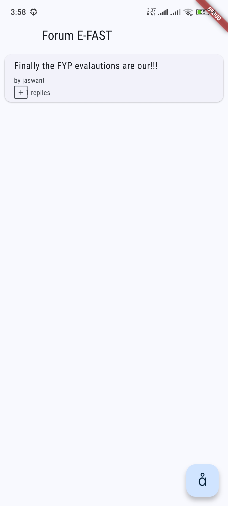
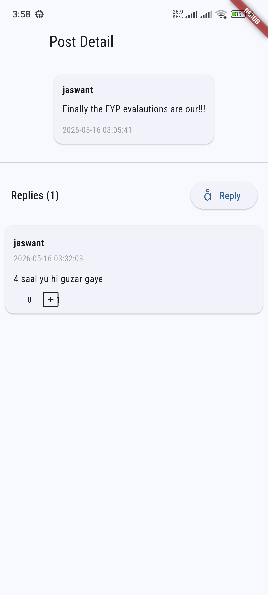
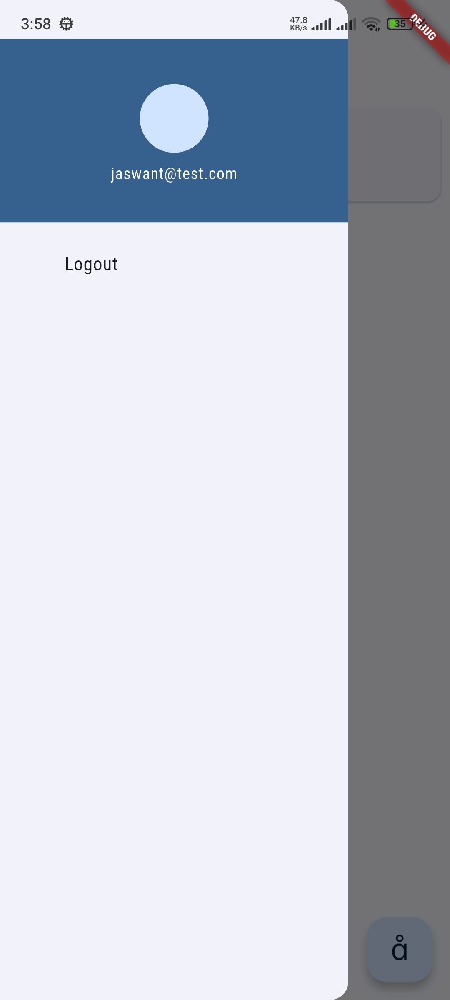

# Forum FAST

<!-- Screenshots -->
<p align="center">
  
  
</p>

<p align="center">
  
  
</p>

## Submission Details:
Section: 8A  
Group Members: 22k4413, 22k4461, 22K-4301, 22K-4473

## Overview

Forum FAST is a Flutter-based forum application built with Firebase (Authentication and Cloud Firestore) and BLoC state management. The app supports user signup/login, creating posts, replies, comments, likes, pagination, and offline-friendly Firestore operations. It follows a 3-layer architecture (Services → Repositories → BLoCs → UI).

## Features

- Email/password authentication (signup, login, logout)
- Create, read, delete forum posts with pagination (infinite scroll)
- View post details with replies (paginated)
- Create replies and comments (nested replies/comments)
- Like replies
- Denormalized counters for fast reads (`replyCount`, `commentCount`)
- Input validation and error handling
- Material 3 design and responsive layout (supports web and mobile)
- Unit tests for BLoCs and utility validators (uses `mockito`, `bloc_test`)

## Architecture

- Firebase Service Layer: `packages/firebase_service` — low-level Firebase interactions (auth + Firestore CRUD) and custom exceptions.
- Repositories: `lib/repositories` — business logic wrappers around the service layer.
- BLoCs: `lib/blocs` — state management for authentication, posts list, and post details (replies/comments).
- UI: `lib/screens`, `lib/widgets` — Flutter screens and reusable widgets.

## Firebase Setup

1. Create a Firebase project and enable Email/Password authentication.
2. Create a Cloud Firestore database (in test mode during development).
3. Add web/android/ios app in Firebase console and download `google-services.json` / `GoogleService-Info.plist` as needed.
4. If Firestore queries involve ordering and filtering across multiple fields (e.g., `where('postId', '==', postId).orderBy('timestamp', descending: true)`), create the required composite indexes via Firebase Console → Firestore → Indexes.

## Running the App

Prerequisites: Flutter SDK (stable), Developer Mode enabled on Windows for symlinks (if building plugins), and Firebase config set up.

1. Install dependencies:

```bash
flutter pub get
```

2. Run the app (web):

```bash
flutter run -d chrome
```

3. Run unit tests (after generating mocks):

```bash
flutter pub run build_runner build
flutter test
```

## Project Structure (key files)

- `packages/firebase_service/` — Firebase service package (models + service API)
- `lib/main.dart` — App entry, DI and MultiBlocProvider setup
- `lib/repositories/` — `auth_repository.dart`, `forum_posts_repository.dart`, `post_detail_repository.dart`
- `lib/blocs/` — `auth_bloc/`, `forum_posts_bloc/`, `post_detail_bloc/`
- `lib/screens/` — `login_screen.dart`, `home_screen.dart`, `post_detail_screen.dart`, `logo_screen.dart`
- `lib/widgets/` — `create_post_dialog.dart`, `reply_tile.dart`, `comment_tile.dart`, `error_dialog.dart`
- `lib/utils/validators.dart` — Input validation helpers
- `test/` — Unit tests for BLoCs and validators

## Important Implementation Notes

- Pagination: Implemented using Firestore document snapshots — queries use `startAfter(lastDoc)` and `limit(pageSize)`.
- Denormalized counters: `replyCount` on `ForumPost` and `commentCount` on `Reply` are updated atomically using `FieldValue.increment()` in Firebase. This avoids slow aggregation queries.
- Error handling: Unified `FirebaseServiceException` thrown by the service layer; BLoCs convert exceptions into error states and UI shows snackbars/dialogs.
- Optimistic UI updates: When creating/deleting items, BLoC updates local state lists immediately then persists changes via repository/service.

## Testing

- Tests use `mockito` and `bloc_test`. Generate mock files before running tests:

```bash
flutter pub run build_runner build --delete-conflicting-outputs
flutter test
```

If you see errors about unresolved mocks, re-run `build_runner`.

## Known Limitations & TODOs

- Avatar images are placeholders (empty string) — can be extended to upload/serve user avatars.
- Comments UI can be extended to stream updates in real-time (currently paginated fetches per-reply).
- More unit tests to increase coverage for `PostDetailBloc` and integration tests for Firebase interactions.

## Contributions

This is a student project. To contribute:

1. Fork the repository
2. Create a feature branch
3. Open a PR with a clear description and tests

## License

Add your license here.

---

If you want, I can add screenshots to the README and generate the mock files/tests for you. Which do you prefer next?
